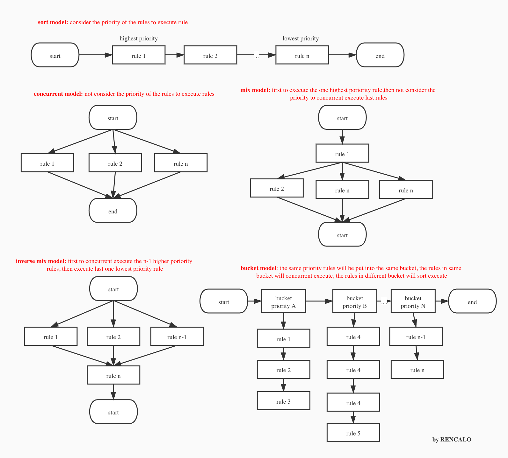

# Gengine
- [简体中文](README_zh.md)

## doc
- rencalo770.github.io/gengine_doc

## the rule engine based on golang 
- this is a rule engine named **Gengine** based on golang and AST, it can help you to load your code(rules) to run while you did not need to restart your application.  
- Gengine's code structure is Modular design, logic is easy to understand, and it passed the necessary testing！
- it is also a high performance engine    

## Thinking in Design of gengine
- chinese article you can read:
 https://xie.infoq.cn/article/40bfff1fbca1867991a1453ac


## the execute model of rules
 

## Grammar support by Gengine
- support the priority of the rules list and the priority scope is -int64 to int64
- support rule's description
- support define a local variable in a rule, and it invisible between rules
- support 'if..else ../ if ..else... /if .. else if ... else'  and it's Nested structure
- support complex logic operation
- support complex Arithmetic (+ -  * /)
- support method of golang's structure 
- support single line comment(//)
- support elegant check error, if there is an error in one rule, gengine will not load the rules to run to forbidden the harm to data 
- to make it easy to use,Gengine just supports one return value function's or method's Assignment and support return struct, but support call multi return value function
- support directly inject function to run, and rename function
- support switch to help user to decide when a rule execute error in the list whether continue to execute the last rules 
- support use '@name' to get rule's name in rule content
- support map, slice, array
- support rule pool, code location: gengine/engine/gengine_pool.go, test case: gengine/test/Pool_test.go

## Gengine not support grammar
- not support Multi-level call such as 'user.ip.ipRisk()'，because it not meet the "Dimit rule", and multi-level call make it hard to understand, so it just support this call type: 'ip.ipRisk()'
- not support multi line comment (/*  comment */)
- not support multi return value, if you want, you can use return struct 
- not support nil 

## something need your attention
- if you not declare the rules' priority, the rules will be execute in unknown sort 
- every rule's name should be different from each other 


## support data type
- string 
- bool  
- int, int8, int16, int32, int64   
- float32, float64

## support logic operation
- &&  
- ||  
- !   

## support compared operation
- ==   
- !=   
- \>   
-  <   
-  \>=  
- <=   

## support math operation
-  \+ 
-  \- 
-  \* 
-  /  
- support string and string's plus

## attention and in action
- if you want get high performance, please do as the test case do: separate the rule build process and the rule execute process    
- when you rules contains Very time-consuming operation, such as operate database, you should use engine.ExecuteConcurrent(...), if not ,you should still use engine.Execute(...)
- newest version is compatible with all older versions
## use 
- go mod or go vendor 


## Gengine rule example
```go
//rule
rule "测试" "测试描述"  salience 0 
begin
		// rename function test; @name represent the rule name "测试"
		Sout(@name)
		// common function test
		Hello()
		//struct's method  test
		User.Say()
		// if
		if !(7 == User.GetNum(7)) || !(7 > 8)  {
			//define variable and string's plus; @name is just a string
			variable = "hello" + (" world" + "zeze")+"@name"
			// inner function
			User.Name = "hhh" + strconv.FormatBool(true)
			//struct's field 
			User.Age = User.GetNum(8976) / 1000+ 3*(1+1) 
			//bool set test
			User.Male = false
			//use inner variable test
			User.Print(variable)
			//float test		
			f = 9.56			
			PrintReal(f)
			//if-else test
			if false	{
				Sout("sout true")
			}else{
				Sout("sout false")
			}
		}else{ //else
			//struct field set value test
			User.Name = "yyyy"
		}
end
```

##  Gengine complete test 
- you can find all code in test package
```go

import (
	"fmt"
	"gengine/base"
	"gengine/builder"
	"gengine/context"
	"gengine/engine"
	"github.com/sirupsen/logrus"
	"testing"
	"time"
)

type User struct {
	Name string
	Age  int
	Male bool
}

func (u *User)GetNum(i int64) int64 {
	return i
}

func (u *User)Print(s string){
	fmt.Println(s)
}

func (u *User)Say(){
	fmt.Println("hello world")
}

const (
	rule2 = `
rule "测试" "测试描述"  salience 0 
begin
		// 重命名函数 测试
		Sout(@name)
		// 普通函数 测试
		Hello()
		//结构提方法 测试
		User.Say()
		// if
		if 7 == User.GetNum(7){
			//自定义变量 和 加法 测试
			variable = "hello" + " world"
			// 加法 与 内建函数 测试
			User.Name = "hhh" + strconv.FormatBool(true)
			//结构体属性、方法调用 和 除法 测试
			User.Age = User.GetNum(89767999999) / 10000000
			//布尔值设置 测试
			User.Male = false
			//规则内自定义变量调用 测试
			User.Print(variable)
			//float测试	也支持科学计数法		
			f = 9.56			
			PrintReal(f)
			//嵌套if-else测试
			if false	{
				Sout("嵌套if测试")
			}else{
				Sout("嵌套else测试")
			}
		}else{ //else
			//字符串设置 测试
			User.Name = "yyyy"
		}
end`)

func Hello()  {
	fmt.Println("hello")
}

func PrintReal(real float64){
	fmt.Println(real)
}

func exe(user *User){
	/**
	 不要注入除函数和结构体指针以外的其他类型(如变量)
	 */
	dataContext := context.NewDataContext()
	//inject struct
	dataContext.Add("User", user)
	//rename and inject
	dataContext.Add("Sout",fmt.Println)
	//直接注入函数
	dataContext.Add("Hello",Hello)
	dataContext.Add("PrintReal",PrintReal)

	//init rule engine 
	knowledgeContext := base.NewKnowledgeContext()
	ruleBuilder := builder.NewRuleBuilder(knowledgeContext, dataContext)

	//resolve rules from string 
	err := ruleBuilder.BuildRuleFromString(rule2)
	if err != nil{
		logrus.Errorf("err:%s ", err)
	}else{
		eng := engine.NewGengine()

		start := time.Now().UnixNano()
		// true: means when there are many rules， if one rule execute error，continue to execute rules after the occur error rule
		err := eng.Execute(ruleBuilder, true)
		end := time.Now().UnixNano()
		if err != nil{
			logrus.Errorf("execute rule error: %v", err)
		}
		logrus.Infof("execute rule cost %d ns",end-start)
		logrus.Infof("user.Age=%d,Name=%s,Male=%t", user.Age, user.Name, user.Male)
	}
}

func Test_Base(t *testing.T){
	user := &User{
		Name: "Calo",
		Age:  0,
		Male: true,
	}
	exe(user)
}

```


## Licence
- Officially authorized by bilibili  (www.bilibili.com)
- BSD licensed

## Question Connection
- write issue or connect
- renyunyi@bilibili.com (become some reason,this mail box may can't get mail)
- M201476117@alumni.hust.edu.cn
